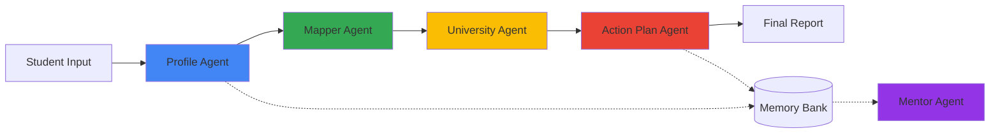

# 🚀 ascentAI: Intelligent Academic Concierge

A **multi-agent academic and university counseling system** designed to transform a student's confusion into a **clear, actionable plan**.

[](https://www.python.org/downloads/)
[](https://github.com/google/adk)
[](https://ai.google.dev/)

---

## 📖 Overview

**ascentAI** is a personalized, long-term academic and university counselor for high school and undergraduate students. It guides students from uncertainty to clarity by:

- **From:** "I'm uncertain about my future and next steps."
- **To:** "I know my track, target schools, and prioritized steps for this year."

### The Problem: Decision Paralysis

Students face critical gaps in academic guidance:

- **Lack of Structure:** Overwhelmed by options without a clear, structured planning process
- **Limited Access:** High student-to-counselor ratios prevent sustained, personalized attention
- **Actionable Gap:** Difficulty connecting abstract interests to realistic academic tracks and timed application steps

### The Solution: Multi-Agent Intelligence

ascentAI delivers **24/7 personalized guidance** through a structured, multi-agent pipeline that:

1. **🔍 Profiles** students by extracting interests, grades, and constraints into a standardized format
2. **🗺️ Maps** student profiles to 2-3 plausible academic tracks/majors using advanced reasoning
3. **🎯 Shortlists** universities into Reach/Target/Safe tiers based on realistic constraints
4. **🗓️ Generates** comprehensive, grade-specific action plans spanning 12-24 months
5. **🔄 Mentors** continuously by following up, tracking progress, and updating roadmaps

---

## 🏗️ Architecture

### Multi-Agent Pipeline

ascentAI uses a **Sequential Multi-Agent System** where data flows through specialized agents:



| Agent | Function | Output |
|-------|----------|--------|
| **Profile Agent** | Data extraction & standardization | Structured student profile (JSON) |
| **Mapper Agent** | Interest-to-major mapping | 2-3 academic tracks + main recommendation |
| **University Agent** | Constraint-based filtering | Reach/Target/Safe university shortlist |
| **Action Plan Agent** | Timeline generation | 12-24 month actionable roadmap |
| **Mentor Agent** | Long-term guidance | Progress-aware mentoring updates |

### Technology Stack

- **Framework:** [Google Agent Development Kit (ADK)](https://github.com/google/adk)
- **LLM:** Gemini 2.5 Flash Lite for advanced reasoning
- **Memory:** In-memory session service for persistent student profiles
- **Custom Tools:** University search and memory management utilities

---

## 🚀 Getting Started

### Prerequisites

- Python 3.11 or higher
- Google API Key (Gemini API access)
- Jupyter Notebook environment (for running the demo)

### Installation

1. **Clone the repository:**
   ```bash
   git clone https://github.com/thecosmos42/ascentAI.git
   cd ascentAI
   ```

2. **Install dependencies:**
   ```bash
   pip install google-adk google-genai
   ```

3. **Set up API credentials:**
   
   For Kaggle notebooks:
   ```python
   from kaggle_secrets import UserSecretsClient
   GOOGLE_API_KEY = UserSecretsClient().get_secret("GOOGLE_API_KEY")
   ```
   
   For local development:
   ```python
   import os
   os.environ["GOOGLE_API_KEY"] = "your-api-key-here"
   ```

---

## 💡 Usage

### 1. Initial Student Profiling

Customize the student description with relevant information:

```python
demo_description = """
My name is Dev. I recently completed a Bachelor of Technology (B.Tech) in Computer Science from India.
I love Artificial Intelligence (AI), deep learning, and data science.
My family can afford medium to high tuition, and I'm focused on pursuing a Master's in AI in the Netherlands or Germany.
My scores: Overall GPA 8.5/10.0, with top scores in Algorithms and Linear Algebra.
I have one year of experience as a Data Analyst.
"""
```

### 2. Get Progress Updates

```python
progress_update = """
Hi, this is Dev again. Since the last plan:
- I built a small ML project and uploaded it on GitHub
- I am doing an internship at an AI startup
What should I focus on next?
"""

mentor_response = await mentor_runner.run_debug(json.dumps({
    "student_id": "student_001",
    "progress_update": progress_update
}))
```

---

## 🛠️ Customization

### University Database

The system uses a customizable university database. To personalize recommendations:

1. Locate the `UNIVERSITY_DB` list in the notebook
2. Add/modify university entries following this schema:

```python
{
    "name": "University Name",
    "country": "Country",
    "tuition_band": "low|medium|high",
    "has_cs": True,
    "has_ds": True,
    "has_business": False,
    "has_psychology": False,
    "notes": "Additional information"
}
```
---

## 📊 Output Format

The system generates a comprehensive Markdown report including:

- **Student Profile:** Name, grade, interests, strengths, constraints
- **Main Track Recommendation:** Chosen academic/career path with justification
- **University Shortlist:** Categorized into Reach, Target, and Safe schools
- **Action Plan Timeline:**
  - Short-term tasks (0-6 months)
  - Medium-term tasks (6-12 months)
  - Long-term tasks (12-24 months)

---

## 🔧 Technical Details

### Custom Tools

1. **UniversitySearchTool:** Filters universities based on profile constraints and chosen track
2. **save_profile_tool:** Persists student profiles to memory
3. **get_profile_tool:** Retrieves stored student profiles
4. **save_plan_tool:** Saves generated action plans
5. **get_plan_tool:** Retrieves stored action plans

### Memory Management

The system maintains two in-memory databases:

- `STUDENT_MEMORY`: Stores structured student profiles
- `PLAN_MEMORY`: Stores generated action plans

This enables the Mentor Agent to provide continuous, context-aware guidance across multiple sessions.

---

## 🎯 Use Cases

- **High School Students:** Planning undergraduate applications
- **Undergraduate Students:** Planning graduate school applications
- **Career Switchers:** Exploring new academic paths
- **Academic Counselors:** Augmenting human counseling with AI-powered insights

---

## 🙏 Acknowledgments

- Developed as part of the [AI Agents Course with Google](https://www.kaggle.com/learn-guide/5-day-agents)
